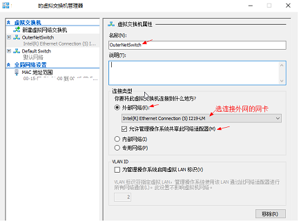
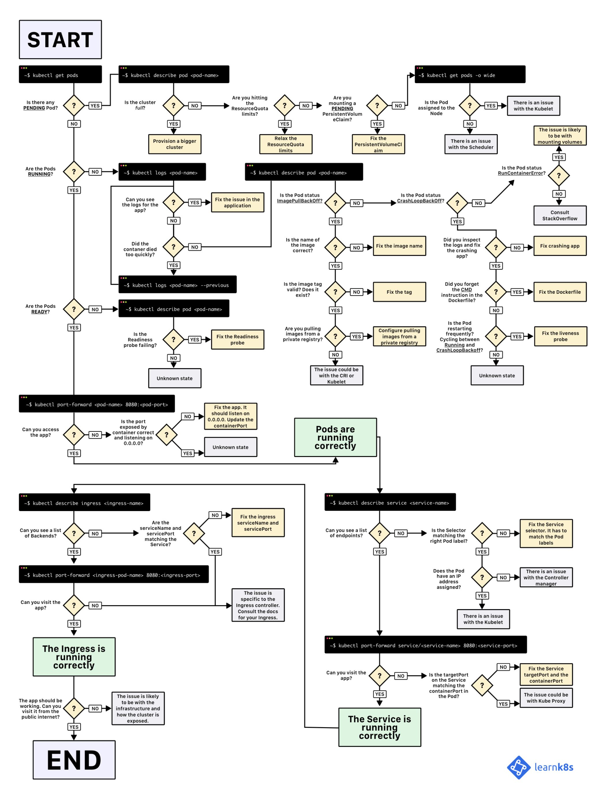

最初学习方案是使用基于 `WSL2` 的 `Docker Desktop for Windows`, 但开启 `Kubernetes` 后遇见各种问题,便有了以下用 `Hyper-V` 搭建一主一丛虚拟机集群环境学习历程

  - 主系统: `Windows10` 20H2 (内部版本 19042.1052)
  - 虚拟机: `Hyper-V`
  - 虚拟机系统: `CentOS 8.4 2105`
  - 主要工具: `VSCode`  `kubeadm`

# 零、容器 和 `Kubernetes` 基础知识
  - 强烈推荐先学阿里云的 [CNCF × Alibaba 云原生技术公开课](https://edu.aliyun.com/course/1651?spm=5176.10731491.0.0.3de58c26EYoEwY)


# 一、Win10 安装 Hyper-V 和 CentOS8

  1. Win10版本要求>=1909, `Win+R` -> 输入 `winver` -> 查看版本
  2. `Win+X` -> 应用和功能 -> 程序和功能 -> 启用或关闭Windows功能 -> [√] Hyper-V -> 重启
  3. 下载 [CentOS 8.4 2105 x86-64](https://www.centos.org/download/) 建议 [科大源](http://mirrors.ustc.edu.cn/centos/8.4.2105/isos/x86_64/) 或 [华为源](http://mirrors.huaweicloud.com/centos/8.4.2105/isos/x86_64/). xxx-boot.iso 相比 xxx-dvd1.iso 少了一些常用软件和环境
  4. 设置虚拟交换机: `Win+S` -> 输入 `Hyper` -> 打开 Hyper-V 管理器 -> 右键点管理器 -> 连接到服务器 -> [√]本地计算机 -> 选中对应计算机名 -> 虚拟交换机管理器 -> 选中外部 -> 创建,如下图:
  5. Hyper-V 管理器 -> 右键点本地计算机名 -> 新建 -> 虚拟机 -> 指定名称和位置 -> 指定代数( `Linux` 选一代) -> 内存(`>=2G`) -> 配置网络(选第4步配置的) -> 连接虚拟硬盘(`>=10G`) -> 选映像文件(第3步下载的iso) -> 完成
  6. Hyper-V 管理器 -> 右键点之前创建的虚拟机 -> 连接 -> 启动 -> 回车 -> English -> 设置 `Root Password` -> 设置 `Installation Destination` -> Done -> 设置 `Network & Host Name` -> On -> 等待 `Installation Source` 自动选为 `Closest mirror` -> 设置 `Software Selection` -> `Virtualization Host` -> Done -> 点 `Begin Installation` -> 等待安装完成 -> 重启虚拟机 -> 输入用户名`root` 和之前设置的密码 -> 关机 -> Hyper-V 管理器 -> 设置 -> 处理器 改为 2 -> 内存 取消 启用动态内存 / 最小RAM改为2560 (做主节点,需要`2核2G`以上)
  7. 重复 `步骤1~7` 新建一台虚拟机 `CentOS8_Node` 做子节点 (或完成`二~四大步骤`后, 使用 `Hyper-V 管理器` 导出导入的方式`克隆`虚拟机) 
  8. 查看虚拟机检查点: `Get-VMCheckpoint -VMName <VMName>` [官方文档](https://docs.microsoft.com/zh-cn/virtualization/hyper-v-on-windows/user-guide/checkpoints)
 
  
# 二、VSCode 使用 Remote - SSH 远程开发管理

  1. CentOS终端 -> 安装并启动 `SSH` -> 输入 `sudo yum install openssh-server && sudo systemctl start sshd.service && sudo systemctl enable sshd.service` 
  2. CentOS终端 -> 获取虚拟机IP地址 -> `ip address` 或 `ifconfig -a` -> 一般在 `eth0 inet` 中
  3. `VSCode` 密码登录连接: 安装 `Remote-SSH` 插件 -> F1 -> `Remote-SSH:Connect to Host` -> `Add New SSH Host` -> 按示例输入,如 `ssh root@192.168.0.200` -> 输入登录密码 -> 连接成功 -> 打开文件夹 -> `/root/` -> 新建目录 `.ssh`
  4. 生成密钥对: `Win10 PowerShell` 输入 -> `ssh-keygen` -> `C:\Users\your_username\.ssh` 目录下 id_rsa(私钥) id_rsa.pub(公钥) -> 将公钥拖到 VSCode 目录 `/root/.ssh/` -> 改名 `authorized_keys` -> <code>Ctrl + `</code> -> 输入命令行 ``systemctl restart sshd.service``
  5. VSCode: F1 -> `Remote-SSH:Open SSH Config...` -> 随意选一个config -> 输入实际配置,示例:
      ```
          Host CentOS8
          HostName 192.168.0.200
          User root
          IdentityFile "C:\Users\jinnblue\.ssh\id_rsa"
      ```
  6. 若无特殊情况之后就可免密登录了; 若还需输入密码，修改 `CentOS` 中相关文件权限并重启 `ssh` 服务
      ```
      - ssh(/root/.ssh)目录的权限改为700
      - authorized_keys和authorized_keys*等文件的权限必须为600或644
      - StrictModes(/etc/ssh/sshd_config文件中)项必须设置成no
      ```
      ```
        如果更换网络或者重启后无法连接，请检查：
        - 查看CentOS虚拟机的ip是否发生了变化
        - Win+X -> 网络连接 -> 更改适配器选项 -> 禁用并重启 OuterNetSwitch
        - VSCode 连接时若一直显示 "connect to vscode server retry n", 且其他地方ssh可直接连接
          "F1" 调出命令框 -> 执行命令 "Uninstall VS Code Server" -> 重新连接
      ```
     

# 三、CentOS 安装 `Docker` [官方文档](https://docs.docker.com/engine/install/#server)

  1. 用 `USTC` 镜像软件源替换原始源, 参考 [USTC CentOS 源使用帮助](http://mirrors.ustc.edu.cn/help/centos.html?highlight=centos)
  2. 删除旧版本 
      ```bash
      sudo yum remove docker docker-client docker-client-latest docker-common docker-latest docker-latest-logrotate docker-logrotate docker-engine
      ```
  3. 通过软件库安装  
      ```bash
      sudo yum install -y yum-utils
      sudo yum-config-manager --add-repo https://download.docker.com/linux/centos/docker-ce.repo
      ```
  4. *可选* : 使用 `VSCode` 打开 `/etc/yum.repos.d/docker-ce.repo`, 将 `download.docker.com` 地址换成 `USTC` 源地址 `mirrors.ustc.edu.cn/docker-ce`
  5. 安装 `Docker Engine`
      ```bash
      # 1 安装最新版本
      sudo yum install docker-ce docker-ce-cli containerd.io
      # 2 列出指定版本并安装
      yum list docker-ce --showduplicates | sort -r
      sudo yum install docker-ce-<VERSION_STRING> docker-ce-cli-<VERSION_STRING> containerd.io
      # 3 启动
      sudo systemctl start docker
      # 4 验证是否正确安装
      sudo docker run hello-world
      ```
  6. 配置 `Docker` 守护程序，尤其是使用 `systemd` 来管理容器的 `cgroup`, 并更换为 `USTC` 源
      ```json
      // VSCode 打开/创建文件夹 /etc/docker/ -> 新建 daemon.json -> 复制以下内容
      { "exec-opts": ["native.cgroupdriver=systemd"],
        "log-driver": "json-file",
        "log-opts": { "max-size": "100m" },
        "storage-driver": "overlay2",
        "registry-mirrors": ["https://docker.mirrors.ustc.edu.cn/"]}
      ```
     - 重新启动 `Docker` 并在启动时启用
      ```bash
      sudo systemctl enable docker
      sudo systemctl daemon-reload
      sudo systemctl restart docker
      ```


# 四、CentOS 安装 `kubeadm` [官方文档](https://kubernetes.io/zh/docs/setup/production-environment/tools/kubeadm/install-kubeadm/#verify-mac-address)

  1. 确保主从节点 `CentOS` 虚拟机 `MAC` 地址和 `product_uuid` 的唯一性
      ```bash
        # 获取 MAC 地址
        ip link 或 ifconfig -a
        # 校验 product_uuid : 
        sudo cat /sys/class/dmi/id/product_uuid
        # 使用 VSCode 修改,注意: <-eth0> 根据虚拟机实际值修改
        code /etc/sysconfig/network-scripts/ifcfg-eth0
        uuidgen eth0 # 将生成值复制到 ifcfg-eth0 配置的 UUID=<uuid> 中
        # 重置 machine-id
        rm /etc/machine-id
        systemd-machine-id-setup
        # 重启
        reboot
      ```
  2. 允许 iptables 检查桥接流量      
     - 确保 br_netfilter 模块被加载。这一操作可以通过运行 lsmod | grep br_netfilter 来完成。若要显式加载该模块，可执行 sudo modprobe br_netfilter。

     - 为了让你的 Linux 节点上的 iptables 能够正确地查看桥接流量，你需要确保在你的 sysctl 配置中将 net.bridge.bridge-nf-call-iptables 设置为 1。例如：
    
      ```bash
          cat <<EOF | sudo tee /etc/modules-load.d/k8s.conf
          br_netfilter
          EOF

          cat <<EOF | sudo tee /etc/sysctl.d/k8s.conf
          net.bridge.bridge-nf-call-ip6tables = 1
          net.bridge.bridge-nf-call-iptables = 1
          EOF
          sudo sysctl --system
      ```
  3. 检查所需端口避免冲突: `netstat -tnp` 或 `lsof -i:端口号`
          
      - 控制平面节点(主节点)

        | 协议    | 方向  | 端口范围   |  作用                    |	使用者  
        |  ----   | ----  |  ----     | ----                    |  ----  
        | TCP     |	入站  |	6443      |	Kubernetes API 服务器    |	所有组件
        | TCP     |	入站  |	2379-2380 |	etcd 服务器客户端        | API	kube-apiserver, etcd
        | TCP     |	入站  |	10250	    | Kubelet API             |	kubelet 自身、控制平面组件
        | TCP     |	入站  |	10251	    | kube-scheduler          | kube-scheduler 自身
        | TCP     |	入站  |	10252	    | kube-controller-manager |	kube-controller-manager 自身
        
      - 工作节点(子节点)

        |协议	    | 方向    |	端口范围     | 作用         | 使用者  
        |  ----   | ----   |  ----        | ----        |  ---- 
        |TCP	    | 入站   |  10250       |	Kubelet API |	kubelet 自身、控制平面组件
        |TCP	    | 入站   |  30000-32767 |	NodePort 服务默认端口范围|	所有组件
  4. 安装 `kubeadm`、`kubelet` 和 `kubectl`
       - kubeadm：用来初始化集群的指令。
       - kubelet：在集群中的每个节点上用来启动 Pod 和容器等
       - kubectl：用来与集群通信的命令行工具
      ```bash
      # 添加 kubernetes 源
      sudo touch /etc/yum.repos.d/kubernetes.repo
      # VSCode 打开 -> 复制以下内容( USTC 源 ) 或使用 阿里源
      [kubernetes]
      name=Kubernetes
      baseurl=http://mirrors.ustc.edu.cn/kubernetes/yum/repos/kubernetes-el7-x86_64
      enabled=1
      gpgcheck=0
      repo_gpgcheck=0
      # 将 SELinux 设置为 permissive 模式（相当于将其禁用）这是允许容器访问主机文件系统所必需的，而这些操作时为了例如 Pod 网络工作正常。
      # 你必须这么做，直到 kubelet 做出对 SELinux 的支持进行升级为止.
      # 如果你知道如何配置 SELinux 则可以将其保持启用状态，但可能需要设定 kubeadm 不支持的部分配置
      sudo setenforce 0
      sudo sed -i 's/^SELINUX=enforcing$/SELINUX=permissive/' /etc/selinux/config
      # 安装
      sudo yum install -y kubelet kubeadm kubectl --disableexcludes=kubernetes
      # kubelet 现在每隔几秒就会重启，因为它陷入了一个等待 kubeadm 指令的死循环
      sudo systemctl enable --now kubelet
      ```
  5. [*配置 cgroup 驱动程序*](https://kubernetes.io/zh/docs/tasks/administer-cluster/kubeadm/configure-cgroup-driver/) 
     - `Kubernetes v1.21` 以上可忽略 ( 如果用户没有在 `KubeletConfiguration` 中设置 `cgroupDriver` 字段, `kubeadm init` 会将它设置为默认值 `systemd` )
  6. 初始化各节点配置
     - 设置HostName `sudo hostnamectl set-hostname master-node` ; 自定义后,查看集群内节点时,就不会显示为 `K8S` 自动生成的名字，便于查看和记忆
     - 设置域名解析(每台虚拟机都必须设置): `code /etc/hosts` 加入以下配置
      ```bash
      192.168.0.200 master-node # 改为实际 master 主机ip
      192.168.0.201 slave-node
      ```
     - 同步时间: `systemctl start chronyd`  |  `systemctl enable chronyd`
     - 禁用开机启动防火墙: `systemctl stop firewalld`  |  `systemctl disable firewalld`
     - 禁用iptables: `systemctl stop iptables`  |  `systemctl disable iptables`
      因 kubernetes 和 docker 在运行中会产生大量的 iptables 规则，为了避免混淆，直接关闭系统的规则     
  7. 关闭Swap(系统的交换分区,可理解为**虚拟内存** -- 内存不足时将部分硬盘虚拟成内存使用);为了性能考虑需要避免开启swap交换,K8S希望所有的服务都不应该超过集群或节点CPU和内存的限制
      ```bash
      sudo swapoff -a # 暂时关闭
      # 永久关闭,注释掉 swap 的自动挂载，使用确认swap已经关闭
      code /etc/fstab # 注释掉 "/dev/mapper/cl-swap ..." 行
      free -m #确认 swap 已经关闭
      ```
  8. 添加网桥过滤和地址转发功能
      ```bash
      # VSCode 打开配置
      code /etc/sysctl.d/kubernetes.conf
      # 添加如下配置
        net.bridge.bridge-nf-call-ip6tables = 1
        net.bridge.bridge-nf-call-iptables = 1
        net.ipv4.ip_forward = 1
        vm.swappiness = 0
      # 重新加载配置
      sysctl -p
      # 加载网桥过滤模块
      modprobe br_netfilter
      # 查看网桥过滤模块是否加载成功,成功会显示两条过滤信息
      lsmod | grep br_netfilter
      ```
  9. 配置 ipvs 功能
  在 `kubernetes` 中 `service` 有两种代理模型,基于 `iptables` 和 `ipvs` , `ipvs` 性能更高，但需要手动载入 `ipvs` 模块
      ```bash
      # 1. 安装 ipset 和 ipvsadm(若安装失败,执行 `yum install epel-release` 后再试)
      sudo yum install ipset ipvsadm -y
      # 2. 添加需要加载的模块写入脚本文件
      cat <<EOF > /etc/sysconfig/modules/ipvs.modules
      #!/bin/bash
      modprobe -- ip_vs
      modprobe -- ip_vs_rr
      modprobe -- ip_vs_wrr
      modprobe -- ip_vs_sh
      modprobe -- nf_conntrack_ipv4
      EOF
      # 3. 为脚本文件添加执行权限
      chmod +x /etc/sysconfig/modules/ipvs.modules
      # 4. 执行脚本文件
      /bin/bash /etc/sysconfig/modules/ipvs.modules
      # 5. 查看对应的模块是否加载成功 (cat /etc/os-release 查看 Kernel 版本,新版本中 nf_conntrack_ipv4 和 nf_conntrack_ipv6 已弃用并合并为 nf_conntrack )
      lsmod | grep -e ip_vs -e nf_conntrack
      # 6. 编辑 /etc/sysconfig/kubelet，添加下面的配置
      # KUBELET_CGROUP_ARGS="--cgroup-driver=systemd" #参考步骤 5
      KUBE_PROXY_MODE="ipvs"
      ```
  10. 完成以上配置后重启服务器 `reboot`


# 五、`Master` 主节点集群初始化

1. 获取镜像列表, 验证与容器镜像仓库的连通性 (官方镜像地址被墙,使用阿里源) 
    ```bash
    # 查看对应版本K8S所需镜像列表
    kubeadm config images list --kubernetes-version=v1.21.1
    # 拉取
    kubeadm config images pull --image-repository=http://registry.cn-hangzhou.aliyuncs.com/google_containers
    ```
     - 如果某个镜像拉取失败(如 `coredns:v1.8.0`),手动 `pull` 并更新 `tag`
    ```bash
    # 查找可用镜像 NAME 并拉取 STARS 多的镜像
    docker search coredns:v1.8.0    
    docker pull <NAME>
    # 更新 tag 并删除原始 NAME 镜像
    docker tag <NAME> registry.cn-hangzhou.aliyuncs.com/google_containers/coredns:v1.8.0
    docker rmi <NAME>
    ```
2. 创建集群 [Kubeadm init](https://kubernetes.io/zh/docs/reference/setup-tools/kubeadm/kubeadm-init/)
   - 由于默认拉取镜像地址 k8s.gcr.io 国内无法访问，这里指定阿里云镜像仓库地址
   - 提示 `master-node` 地址解析错误时,检查 `四-6` 步骤是否完成
   - 提示内存不足时, 检查 `一-6` 步骤是否完成
    ```bash
    kubeadm init \
    --image-repository registry.cn-hangzhou.aliyuncs.com/google_containers \
    --kubernetes-version=v1.21.1 \
    --pod-network-cidr=10.244.0.0/16
    # 等待初始化完成 喝杯☕吧
    ```
3. 初始化完成后, **注意保存** 显示的 `kubeadm join` 命令.用于其他节点加入到集群中，Token有时效性，过期时间一般为一天,失效后需要重新生成
    ```bash
    kubeadm join 你的IP地址:6443 --token 你的TOKEN --discovery-token-ca-cert-hash sha256:你的CA证书哈希
    ```
   - #如果又没有保存,又失效了,参考下述两个补救措施.已保存请跳过
   - token: 通过命令 `Kubeadm token list` 找回
   - ca-cert: 执行命令 `openssl x509 -pubkey -in /etc/kubernetes/pki/ca.crt | openssl rsa -pubin -outform der 2>/dev/null | openssl dgst -sha256 -hex | sed 's/^.* //'` 找回
4. 配置授权信息:保存相关配置信息到用户目录下,不用每次都输入相关的认证信息;避免在控制节点上执行 `kubectl` 这类命令时每次都用 `sudo`
    ```bash
    mkdir -p $HOME/.kube
    sudo cp -i /etc/kubernetes/admin.conf $HOME/.kube/config
    sudo chown $(id -u):$(id -g) $HOME/.kube/config
    ```
5. 安装网络插件: `K8S` 支持多种网络插件如 `flannel` / `calico` / `canal` 等,这里用 [flanne](https://github.com/flannel-io/flannel)
    - `K8S` 要求集群内所有节点之间的 `Pod` 网络必须是互通的
    - `Flannel` 能让不同节点上的容器拥有一个在当前集群内唯一的虚拟 `IP` 地址,实现跨节点的 `Pod` 与 `Pod` 直接通信
    - 通过虚拟二层网络实现:看似是A节点的 `Pod` 直接和B节点上的 `Pod` 通信，最终还是通过节点的物理网卡流出的
   ```bash
    # 1. Kubernetes v1.17+ 可直接执行以下命令
    kubectl apply -f https://raw.githubusercontent.com/coreos/flannel/master/Documentation/kube-flannel.yml
    # 2. 失败 或 低版本 K8S 手动下载 releases 中的包并上传至 master 服务器
    docker load < $HOME/flannel/flanneld-v0.14.0-amd64.docker
    # 3. 本地创建配置, 复制 https://github.com/flannel-io/flannel/blob/master/Documentation/kube-flannel.yml 中的内容并保存
    code $HOME/flannel/kube-flannel.yml
    kubectl apply -f $HOME/flannel/kube-flannel.yml
    # 4. 确认 master节点的状态为 READY
    kubectl get nodes
    # 5. 确认当前集群中所有Pod的状态为 RUNNING, 
    kubectl get pods --all-namespaces
    ```
6. `Slave` 节点加入集群
    - 上述步骤结束后,单点的集群就已搭建好了,现在登录准备好的另一台虚拟机(如果使用 Hyper-V 管理器的 导出 -> 导入 复制 `Master` 虚拟机, 需按 `步骤四-1` 检查更改并用 `kubeadm reset` 重置K8S)
    - 设置 HostName : `sudo hostnamectl set-hostname slave-node`
    - 加入集群: 执行 `五-3` 生成的 `kubeadm join` 命令
    - 检查 `Node` `Pod` 状态: `kubectl get nodes` 和 `kubectl get pods -A`


# 六、`Master` 主节点配置 `Kubernetes` 控制台

1. Web界面 [部署 Dashboard UI](https://kubernetes.io/zh/docs/tasks/access-application-cluster/web-ui-dashboard/)
    ```bash
    # 1. 直接部署
    $ kubectl apply -f https://raw.githubusercontent.com/kubernetes/dashboard/v2.3.1/aio/deploy/recommended.yaml
    # 2. 失败时手动创建本地配置, 复制 https://github.com/kubernetes/dashboard/tree/v2.3.1/aio/deploy/recommended.yaml 中的内容并保存
    code $HOME/k8s_dashboard/kubernetes-dashboard.yaml
    # 在 kind: Service -> spec: 指定端口类型为 NodePort
      kind: Service
      ......
      spec:
        type: NodePort #添加类型,使外界可通过地址 nodeIP:nodePort 访问 dashboard
    # 
    kubectl create -f $HOME/k8s_dashboard/kubernetes-dashboard.yaml
    # 检查 kubernetes-dashboard 应用状态
    kubectl get pods,svc -n kubernetes-dashboard
    ```
     - 注意查看 [版本兼容信息](https://github.com/kubernetes/dashboard/releases)
2. 配置控制台访问令牌
   - 快速开始: [创建示例用户](https://github.com/kubernetes/dashboard/blob/master/docs/user/access-control/creating-sample-user.md)
    ```bash
    # 1. 复制 Master 虚拟机 "/root/.kube/config" 中的内容到 Win10 "%UserProfile%\.kube\config" 中
    # 2. 查看 Token 并 设置
    $TOKEN=kubectl -n kubernetes-dashboard get secret $(kubectl -n kubernetes-dashboard get sa/admin-user -o jsonpath="{.secrets[0].name}") -o go-template="{{.data.token | base64decode}}"
    kubectl config set-credentials admin-user --token="${TOKEN}"
    echo $TOKEN
    # 3. Win10 config 中 "context" 替换为 "admin-user" 并在 "users" 中删除其他用户
    ```
   - 获取 `NodeType` 映射端口,通过 `https://\<masterHost\>:32420` 访问 `Web UI` -> 全部命名空间
    ```bash
    kubectl get pods,svc -n kubernetes-dashboard
    # kubernetes-dashboard   ...       443:32420/TCP            ...
    ```
   - 其他问题参考 `dashboard` [官方文档](https://github.com/kubernetes/dashboard/blob/master/README.md)

# 七、常用工具

1. 安装 Helm [官方文档](https://helm.sh/zh/docs/intro/install/)
   - 下载 [需要的版本](https://github.com/helm/helm/releases)
   - 放入虚拟机中 -> 解压 `tar -zxvf helm-v3.6.1-linux-amd64.tar.gz`
   - 移动到需要的目录中 `mv linux-amd64/helm /usr/local/bin/helm`
2. 安装 Ingress [官方文档](https://github.com/kubernetes/ingress-nginx/blob/master/docs/deploy/index.md#using-helm)
   - 验证
    ```shell
    kubectl get pods --all-namespaces -l app.kubernetes.io/name=ingress-nginx
    ```
   - 测试示例应用,详情参见 [社区文章](https://matthewpalmer.net/kubernetes-app-developer/articles/kubernetes-ingress-guide-nginx-example.html)

# 八、常用文档
1. K8S 排查手册,来自博客 [《Kubernetes Deployment 故障排除图解指南》](https://tonybai.com/2019/12/08/k8s-deployment-troubleshooting/)
   - [pdf版](https://tonybai.com/wp-content/uploads/k8s-deployment-troubleshooting/troubleshooting-kubernetes.pdf)
   - 图片版
  
   


